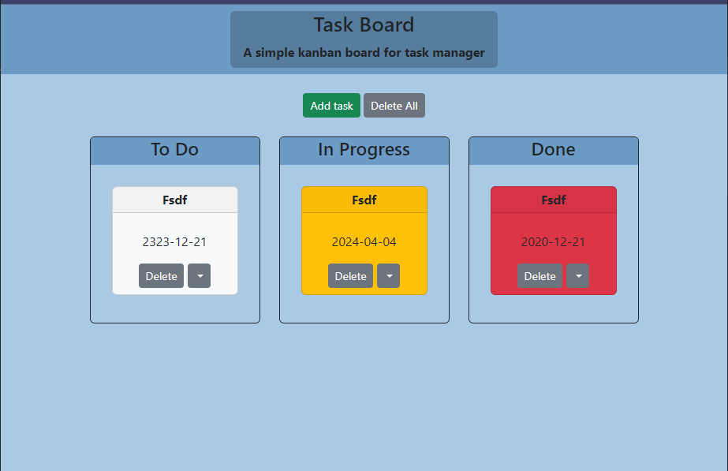

# Task Manager UI

The Task Manager UI is a simple, intuitive Kanban board application designed to help users manage their tasks efficiently. 

it allows for easy task organization into columns representing different stages of completion, such as "To Do", "In Progress", and "Done".

App live at: https://febres0492.github.io/bcs-task-board/

## Technologies

- HTML
- CSS 
- Bootstrap 
- jQuery

## Features

- **Add Tasks**: Add new tasks with titles, descriptions, and due dates.
- **Drag and Drop**: Tasks can be moved across columns.
- **Dynamic Task Colors**: Tasks are color-coded based on their due date.
- **Delete Tasks**: Delete individual tasks or clear all tasks from the board.
- **Persistent Storage**: Tasks are stored in local storage.
- **Responsive Design**: The UI is responsive.

## How to Use

1. **Adding a Task**: Click the "Add task" button, fill in the task details, and click "Save Task".
2. **Moving a Task**: Click and drag a task card to move it to a different column based on its progress.
3. **Deleting a Task**: Click the "Delete" button on a task to remove it from the board. To delete all tasks, click the "Delete All" button.
4. **Viewing Tasks**: Tasks are automatically loaded and displayed from the local storage upon application startup.

## Contributions

Contributions to the Task Manager UI are welcome. Please ensure to follow the project's coding standards and submit pull requests for any new features or bug fixes.

## Author

Carlose Febres

